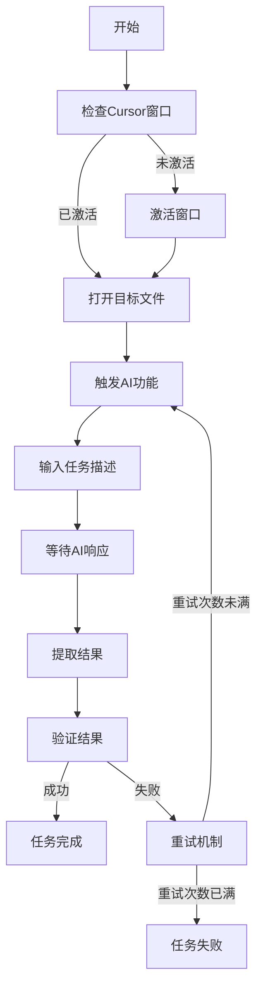

# Cursor IDE 自动化操作规格文档

## 1. 需求规格

### 1.1 目标
实现通过CyberCorp Node系统自动化控制Cursor IDE执行子任务，建立高效的任务委托机制。

### 1.2 功能需求
- **FR1**: 控制Cursor打开指定文件
- **FR2**: 触发Cursor的AI对话功能
- **FR3**: 向AI输入任务描述
- **FR4**: 等待AI响应完成
- **FR5**: 提取AI生成的代码或文本
- **FR6**: 验证任务执行结果
- **FR7**: 处理错误和异常情况

### 1.3 非功能需求
- **NFR1**: 响应时间 < 2秒（UI操作）
- **NFR2**: 成功率 > 95%
- **NFR3**: 支持任务队列和并发控制
- **NFR4**: 提供操作日志和截图证据

## 2. 技术规格

### 2.1 Cursor快捷键映射
```
Ctrl+K        - 打开命令面板
Ctrl+L        - 打开AI聊天
Ctrl+Shift+L  - 内联AI编辑
Ctrl+I        - AI编写模式
Alt+K         - 生成代码
```

### 2.2 UI元素定位策略
- 使用窗口句柄和类名定位
- 使用UIA自动化框架获取控件
- 使用OCR识别动态内容
- 使用图像匹配作为备选方案

### 2.3 任务执行流程


## 3. 接口规格

### 3.1 命令接口
```python
# 执行Cursor子任务
execute_cursor_task(params):
    file_path: str      # 目标文件路径
    task_type: str      # 任务类型: "generate", "edit", "explain", "fix"
    prompt: str         # 任务描述
    context: dict       # 额外上下文（可选）
    timeout: int        # 超时时间（默认30秒）
    
# 返回格式
{
    "success": bool,
    "data": {
        "task_id": str,
        "result": str,      # AI生成的内容
        "file_path": str,   # 处理的文件
        "duration": float,  # 执行时长
        "screenshots": []   # 过程截图
    },
    "error": str           # 错误信息（如果失败）
}
```

### 3.2 任务类型定义
- **generate**: 生成新代码
- **edit**: 编辑现有代码
- **explain**: 解释代码功能
- **fix**: 修复代码问题
- **refactor**: 重构代码
- **test**: 生成测试用例

## 4. 实现策略

### 4.1 第一阶段：基础控制
- 实现窗口激活和文件打开
- 实现快捷键触发AI功能
- 实现简单文本输入

### 4.2 第二阶段：智能交互
- 实现AI响应检测
- 实现结果提取
- 实现错误处理

### 4.3 第三阶段：高级功能
- 实现任务队列
- 实现并发控制
- 实现结果缓存

## 5. 测试规格

### 5.1 单元测试
- 测试各个UI操作函数
- 测试快捷键发送
- 测试文本提取

### 5.2 集成测试
- 测试完整任务流程
- 测试错误恢复
- 测试并发场景

### 5.3 性能测试
- 测试响应时间
- 测试资源占用
- 测试稳定性

## 6. 风险管理

### 6.1 技术风险
- Cursor UI变更导致定位失败
- AI响应时间不确定
- 网络问题影响AI功能

### 6.2 缓解措施
- 实现多种定位策略
- 设置合理超时机制
- 提供离线备选方案

## 7. 版本历史
- v1.0.0 (2025-07-20): 初始版本，定义基础规格