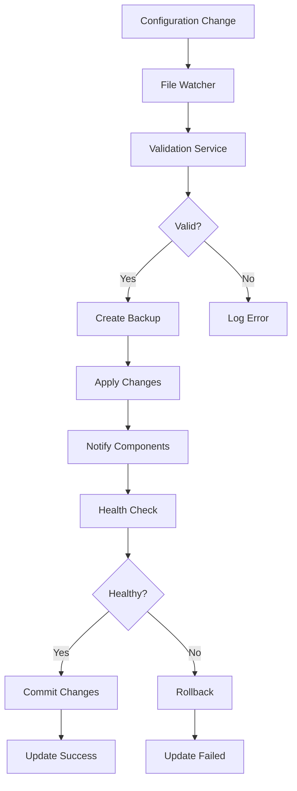

# CyberCorp Hot Reload Architecture

## Overview
The CyberCorp hot reload architecture enables zero-downtime configuration and code updates across both server and client components, ensuring continuous operation while maintaining system stability.

## Architecture Principles
- **Zero Downtime**: No service interruption during updates
- **Atomic Updates**: All-or-nothing configuration changes
- **Rollback Capability**: Automatic rollback on failure
- **Validation First**: Validate before applying changes
- **Graceful Degradation**: Continue operation with last known good state
- **Real-time Feedback**: Immediate notification of update status

## Hot Reload Components

### 1. Configuration Hot Reload
Dynamic configuration updates without service restart.

### 2. Code Hot Reload
Development-time code updates for faster iteration.

### 3. Plugin Hot Reload
Dynamic loading/unloading of system plugins.

### 4. UI Hot Reload
Client-side UI component updates.

## Configuration Hot Reload

### Architecture Flow


### Configuration Watcher
```python
class ConfigurationWatcher:
    """Watches configuration files for changes."""
    
    def __init__(self, config_paths: List[str], debounce_ms: int = 500):
        self.config_paths = config_paths
        self.debounce_ms = debounce_ms
        self.observers = []
    
    def start(self):
        """Start watching configuration files."""
        pass
    
    def stop(self):
        """Stop watching configuration files."""
        pass
    
    def add_change_handler(self, handler: Callable[[ConfigChange], None]):
        """Add handler for configuration changes."""
        pass
```

### Configuration Validator
```python
class ConfigurationValidator:
    """Validates configuration changes."""
    
    def validate(self, config: Dict[str, Any], schema: Dict[str, Any]) -> ValidationResult:
        """Validate configuration against schema."""
        pass
    
    def validate_runtime(self, config: Dict[str, Any]) -> ValidationResult:
        """Validate configuration at runtime."""
        pass
```

### Configuration Manager
```python
class ConfigurationManager:
    """Manages configuration with hot reload support."""
    
    def __init__(self, config_path: str, schema_path: str):
        self.config_path = config_path
        self.schema_path = schema_path
        self.current_config = {}
        self.backup_config = {}
    
    def load_config(self) -> Dict[str, Any]:
        """Load configuration from file."""
        pass
    
    def reload_config(self) -> ReloadResult:
        """Reload configuration with validation."""
        pass
    
    def update_config(self, updates: Dict[str, Any]) -> UpdateResult:
        """Update specific configuration values."""
        pass
    
    def rollback_config(self) -> RollbackResult:
        """Rollback to previous configuration."""
        pass
```

## Code Hot Reload (Development)

### Development Server
```python
class DevelopmentServer:
    """Development server with hot reload."""
    
    def __init__(self, app_path: str, reload_dirs: List[str]):
        self.app_path = app_path
        self.reload_dirs = reload_dirs
        self.watcher = None
    
    def start(self):
        """Start development server with hot reload."""
        pass
    
    def restart(self):
        """Gracefully restart the application."""
        pass
    
    def reload_modules(self, modules: List[str]):
        """Reload specific modules."""
        pass
```

### Module Reloader
```python
class ModuleReloader:
    """Handles module reloading for development."""
    
    def watch_module(self, module_name: str):
        """Watch a module for changes."""
        pass
    
    def reload_module(self, module_name: str) -> ReloadResult:
        """Reload a specific module."""
        pass
    
    def get_changed_modules(self) -> List[str]:
        """Get list of changed modules."""
        pass
```

## Plugin Hot Reload

### Plugin Architecture
```python
class PluginManager:
    """Manages dynamic plugin loading/unloading."""
    
    def __init__(self, plugin_dir: str):
        self.plugin_dir = plugin_dir
        self.loaded_plugins = {}
    
    def load_plugin(self, plugin_name: str) -> LoadResult:
        """Load a plugin dynamically."""
        pass
    
    def unload_plugin(self, plugin_name: str) -> UnloadResult:
        """Unload a plugin gracefully."""
        pass
    
    def reload_plugin(self, plugin_name: str) -> ReloadResult:
        """Reload a plugin."""
        pass
    
    def list_plugins(self) -> List[PluginInfo]:
        """List all available plugins."""
        pass
```

### Plugin Interface
```python
class PluginInterface:
    """Base interface for hot-reloadable plugins."""
    
    def initialize(self, config: Dict[str, Any]) -> bool:
        """Initialize the plugin."""
        pass
    
    def cleanup(self) -> bool:
        """Clean up plugin resources."""
        pass
    
    def get_status(self) -> PluginStatus:
        """Get plugin status."""
        pass
    
    def update_config(self, config: Dict[str, Any]) -> bool:
        """Update plugin configuration."""
        pass
```

## UI Hot Reload

### Client-Side Hot Reload
```python
class UIHotReloader:
    """Handles client-side UI hot reload."""
    
    def __init__(self, ui_components_path: str):
        self.ui_components_path = ui_components_path
    
    def reload_component(self, component_name: str) -> ReloadResult:
        """Reload a specific UI component."""
        pass
    
    def reload_theme(self, theme_path: str) -> ReloadResult:
        """Reload UI theme."""
        pass
    
    def reload_styles(self, styles_path: str) -> ReloadResult:
        """Reload CSS/styles."""
        pass
```

### WebSocket Hot Reload
```python
class WebSocketHotReload:
    """WebSocket-based hot reload for clients."""
    
    def __init__(self, websocket_manager):
        self.websocket_manager = websocket_manager
    
    def broadcast_reload(self, component: str, data: Dict[str, Any]):
        """Broadcast reload event to all clients."""
        pass
    
    def send_reload_to_client(self, client_id: str, component: str, data: Dict[str, Any]):
        """Send reload event to specific client."""
        pass
```

## Health Checks

### System Health Monitor
```python
class SystemHealthMonitor:
    """Monitors system health during hot reload."""
    
    def __init__(self, check_interval: int = 30):
        self.check_interval = check_interval
        self.health_checks = []
    
    def add_health_check(self, name: str, check_func: Callable[[], bool]):
        """Add a health check function."""
        pass
    
    def check_health(self) -> HealthStatus:
        """Perform comprehensive health check."""
        pass
    
    def get_health_summary(self) -> HealthSummary:
        """Get health check summary."""
        pass
```

### Health Check Types
- **Database Connectivity**: Check database connection
- **API Endpoints**: Verify API responsiveness
- **WebSocket Connections**: Check WebSocket health
- **Memory Usage**: Monitor memory consumption
- **CPU Usage**: Monitor CPU utilization
- **Disk Space**: Check available disk space

## Rollback Strategy

### Automatic Rollback Triggers
- Configuration validation failures
- Health check failures (>50% checks failing)
- Exception rates above threshold
- Memory usage >90%
- API response time >5 seconds

### Rollback Process
```python
class RollbackManager:
    """Manages automatic rollback on failures."""
    
    def __init__(self, backup_retention: int = 10):
        self.backup_retention = backup_retention
        self.backups = []
    
    def create_backup(self, config: Dict[str, Any]) -> BackupInfo:
        """Create configuration backup."""
        pass
    
    def rollback_to_last_good(self) -> RollbackResult:
        """Rollback to last known good state."""
        pass
    
    def rollback_to_version(self, version: str) -> RollbackResult:
        """Rollback to specific version."""
        pass
```

## Hot Reload Events

### Event Types
```python
class HotReloadEvent:
    """Base class for hot reload events."""
    
    def __init__(self, event_type: str, timestamp: datetime, source: str):
        self.event_type = event_type
        self.timestamp = timestamp
        self.source = source

class ConfigReloadEvent(HotReloadEvent):
    """Configuration reload event."""
    
    def __init__(self, changes: Dict[str, Any], validation_result: ValidationResult):
        super().__init__("config_reload", datetime.now(), "file_watcher")
        self.changes = changes
        self.validation_result = validation_result

class CodeReloadEvent(HotReloadEvent):
    """Code reload event."""
    
    def __init__(self, modules: List[str], reload_result: ReloadResult):
        super().__init__("code_reload", datetime.now(), "development_server")
        self.modules = modules
        self.reload_result = reload_result
```

### Event Handling
```python
class HotReloadEventBus:
    """Event bus for hot reload notifications."""
    
    def __init__(self):
        self.subscribers = {}
    
    def subscribe(self, event_type: str, handler: Callable[[HotReloadEvent], None]):
        """Subscribe to hot reload events."""
        pass
    
    def publish(self, event: HotReloadEvent):
        """Publish hot reload event."""
        pass
```

## Monitoring and Alerting

### Hot Reload Metrics
- **Reload Success Rate**: Percentage of successful reloads
- **Reload Duration**: Time taken to complete reload
- **Rollback Count**: Number of automatic rollbacks
- **Validation Failures**: Configuration validation failures
- **Health Check Failures**: Post-reload health issues

### Alerting Rules
- **High Failure Rate**: >10% reload failures in 1 hour
- **Long Reload Time**: >30 seconds for configuration reload
- **Frequent Rollbacks**: >3 rollbacks in 1 hour
- **Validation Issues**: >5 validation failures in 10 minutes

## Development vs Production

### Development Mode
- **File Watching**: Enabled for all source files
- **Auto Reload**: Automatic reload on file changes
- **Detailed Logging**: Verbose reload logging
- **Debug Endpoints**: Special endpoints for debugging
- **Faster Restart**: Aggressive caching disabled

### Production Mode
- **Manual Reload**: Configuration reload via API only
- **Validation Strict**: Strict validation with rollback
- **Minimal Logging**: Essential logs only
- **Health Checks**: Comprehensive health monitoring
- **Graceful Degradation**: Continue serving with old config

## Testing Hot Reload

### Test Scenarios
1. **Configuration Validation**: Invalid configuration handling
2. **Rollback Testing**: Automatic rollback on failure
3. **Concurrent Updates**: Multiple simultaneous updates
4. **Resource Cleanup**: Proper cleanup during reload
5. **State Preservation**: Maintaining application state

### Test Framework
```python
class HotReloadTestSuite:
    """Test suite for hot reload functionality."""
    
    def test_config_reload(self):
        """Test configuration reload."""
        pass
    
    def test_rollback_on_failure(self):
        """Test rollback on validation failure."""
        pass
    
    def test_health_check_failure(self):
        """Test rollback on health check failure."""
        pass
    
    def test_concurrent_reloads(self):
        """Test concurrent reload requests."""
        pass
```

## Best Practices

### Configuration Design
- **Backward Compatibility**: Maintain backward compatibility
- **Validation Rules**: Comprehensive validation rules
- **Default Values**: Sensible defaults for all settings
- **Documentation**: Clear documentation for all options

### Error Handling
- **Graceful Degradation**: Continue operation on minor issues
- **User Feedback**: Clear error messages to users
- **Logging**: Comprehensive logging for debugging
- **Monitoring**: Real-time monitoring and alerting

### Security Considerations
- **Validation**: Validate all configuration inputs
- **Permissions**: Check permissions for configuration changes
- **Audit Trail**: Log all configuration changes
- **Encryption**: Encrypt sensitive configuration data