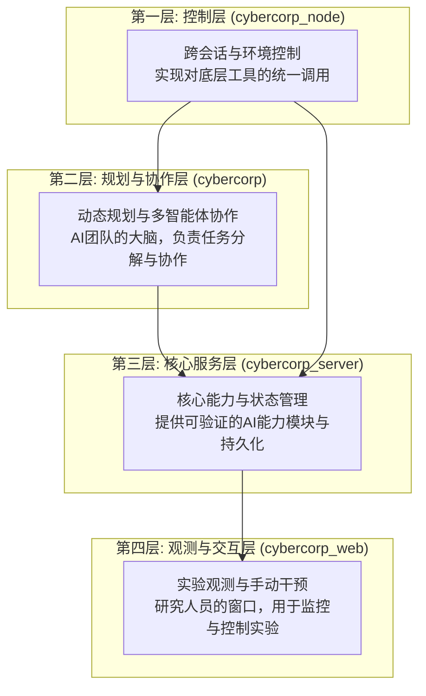

# CyberCorp 战略思考与技术展望

**分析日期**: 2025-07-19  
**分析团队**: AI 系统分析组  
**文档版本**: 2.0
**核心理论**: [mathematical-ai-bootstrapping.md](mathematical-ai-bootstrapping.md)
**长期规划**: [PRD-longterm.md](PRD-longterm.md)

---

## 核心摘要

CyberCorp 项目是一个以**数学可验证的AI自举进化**为核心的科学探索平台。它旨在通过构建一个由AI自身驱动、并能自我改进的虚拟研发生态系统，为通用人工智能（AGI）的实现提供一条可控、可预测且具备安全保障的实证路径。本项目本质上是一个**研究工具**，而非商业产品。

---

## 战略定位：AGI研究的实验平台

CyberCorp的独特定位是作为连接当前AI能力与未来AGI理论的桥梁，其核心价值在于：
- **AI自举进化**：探索AI系统"自我编程、自我改进"的递归智能放大机制。
- **数学安全保障**：在严格的数学框架内进行AI能力增长实验，确保过程可控。
- **Computer-Use技术驱动**：利用前沿的Computer-Use技术，使AI能够像人类一样使用开发工具，打破虚拟与现实的操作鸿沟。
- **集体智能涌现**：研究多AI智能体协作时，超越个体能力总和的智能涌现现象。

---

## 架构深度解析：一个为研究设计的四层系统

### 关键架构决策
- **异步优先**：整个系统基于异步架构，为大规模、并行的AI协作实验提供性能基础。
- **WebSocket中心**：作为主要的通信协议，确保实验过程中状态的实时同步和低延迟交互。
- **Pydantic模型**：在所有组件间强制实施类型安全，保证复杂数据交换的准确性。
- **可配置化**：允许研究人员灵活调整实验参数，如AI角色、改进算法和安全边界。

---

## 核心研究方向与技术能力

### 1. **数学AI自举引擎 (Mathematical AI Bootstrapping Engine)**
- **研究阶段**: 理论模型已建立，进入实验验证阶段
- **核心指标**:
    - **智能放大系数 (Intelligence Amplification)**: 理论值 >1.5x
    - **递归改进效率 (Recursive Improvement Efficiency)**: 理论值 >15%
    - **模型预测精度**: 实际增长与数学模型预测误差 <10%
- **技术实现**:
    - 基于微分方程对AI能力增长进行建模。
    - 通过实时反馈循环，动态调整模型参数。
    - 设定严格的数学安全边界，防止能力失控。

### 2. **虚拟AI研发生态 (Virtual AI R&D Ecosystem)**
- **研究阶段**: 初期原型搭建
- **核心特性**:
    - 模拟多角色AI研发团队（如研究员、架构师、测试员）。
    - 基于能力评估模型，实现动态任务分配。
    - 实时追踪并分析AI团队的协作效率与智能涌现。

### 3. **Computer-Use 技术栈 (Computer-Use Technology Stack)**
- **研究阶段**: 核心能力已实现，持续优化中
- **关键能力**:
    - **跨会话IDE控制**: 实现对VSCode等开发环境的稳定、长期控制。
    - **后台窗口内容分析**: 无需前台激活即可读取和理解UI布局。
    - **直接UI操控**: 通过模拟输入，实现对任意图形化界面的精确操作。

---

## 技术风险评估

### 高风险领域
1.  **递归改进停滞 (Recursive Improvement Stagnation)**
    *   **概率**: 中
    *   **影响**: 高
    *   **缓解策略**: 引入多样化的AI角色和改进算法；建立外部问题库以刺激系统突破局部最优。

2.  **数学模型与现实偏离 (Model-Reality Divergence)**
    *   **概率**: 中
    *   **影响**: 高
    *   **缓解策略**: 持续进行模型校准；增加模型的复杂度以更好地拟合现实；在关键节点设置人工验证。

3.  **Computer-Use 技术瓶颈**
    *   **概率**: 低
    *   **影响**: 中
    *   **缓解策略**: 开发多重UI识别与操作的备用方案；专注于更可靠的结构化数据（如Accessibility Tree）而非纯图像识别。

### 安全机制：以数学为核心的保障
- **能力边界控制**: 通过数学模型严格限制AI单次迭代的能力增幅。
- **人类监督回路**: 在关键的进化节点（如架构变更、自我替换）必须有人类研究员的批准。
- **紧急“熔断”机制**: 提供可以立即暂停整个系统的最高权限指令。
- **决策过程透明化**: 所有AI的决策、代码和测试结果都将被记录，以供审计和分析。

---

## 技术债务与未来演进方向

### 当前技术债务
1.  **前端观测界面 (cybercorp_web)**: 目前仅有基础原型，需要一个功能完善的仪表盘来更好地监控实验。
2.  **数据库**：当前使用SQLite，对于大规模、长周期的实验数据记录，需要迁移到更稳定的数据库（如PostgreSQL）。
3.  **监控与可观测性**: 仅有基础日志，需要引入更全面的监控系统（如Prometheus, Grafana）来追踪系统状态和AI行为。

### 未来架构演进
1.  **微服务化**: 将当前的单体服务拆分为更小的、围绕特定研究领域（如规划、执行、评估）的微服务。
2.  **事件溯源 (Event Sourcing)**: 采用事件溯源架构，以完整记录AI生态演化的每一个状态变化，便于复盘和分析。
3.  **GraphQL API**: 引入GraphQL，为研究人员提供更灵活的数据查询能力。

---

## 战略路线图：聚焦科研里程碑

### 近期 (3-6个月)
1.  **完成 `cybercorp_web` 观测平台**: 提供一个强大的前端界面，用于实时监控实验、回溯AI决策过程。
2.  **迁移到 PostgreSQL**: 增强数据记录的稳定性和查询性能。
3.  **完善安全审计功能**: 确保所有AI行为都可被追踪和审查。
4.  **启动第一轮端到端自举实验**: 与3-5个内部研究项目合作，进行初步验证。

### 中期 (6-12个月)
1.  **开发高级分析仪表盘**: 提供预测性分析，预警潜在的改进停滞或模型偏离。
2.  **构建AI能力市场**: 在系统内部创建一个“能力市场”，让AI智能体可以“交易”或“学习”彼此的能力。
3.  **发布研究工具包**: 将项目的核心组件打包，方便其他AI研究机构部署和使用。

### 长期 (12-24个月)
1.  **启动AGI临界实验**: 在安全框架内，谨慎地进行触及AGI临界点的探索性实验。
2.  **构建多生态互联**: 探索让多个独立的CyberCorp生态系统进行交互和协作的可能性。
3.  **发布行业标准**: 提出一套基于数学验证的、安全的AI自举进化协议。

---

## 核心成功指标：衡量科研进展

### 技术指标
- **智能放大因子**: 实验值与理论预测值的拟合度 >95%。
- **递归改进效率**: 连续多个迭代周期的平均能力增长 >15%。
- **集体智能涌现度**: 多智能体协作解决复杂问题的能力比最佳单体智能体高出 >30%。
- **AGI 指数**: 在预设的安全边界内，稳步接近理论临界值0.85。

### 研究影响力指标
- 在顶级AI会议和期刊上发表的论文数量。
- 项目被其他研究机构引用的次数。
- 对开源社区和AI安全领域的贡献。

---

## 结论

CyberCorp 是一个纯粹的**科研项目**，其核心价值在于为探索AGI提供一个**数学上可控、技术上可行**的实验平台。它的成功不以商业收入衡量，而以其在推动AI自举、递归改进和安全研究方面的贡献来评判。

**核心战略洞察**: CyberCorp 的真正突破在于，它不仅仅是构建一个更聪明的AI，而是创建一个能够**理解并系统性地让自己变得更聪明**的AI生态系统。这为我们提供了一个独特的窗口，去观察、引导并确保未来超级智能的良性发展。

当前架构为这一宏大目标提供了坚实的基础。下一步的重点是加速开发观测和分析工具，以支持更复杂的、长周期的自举进化实验。

