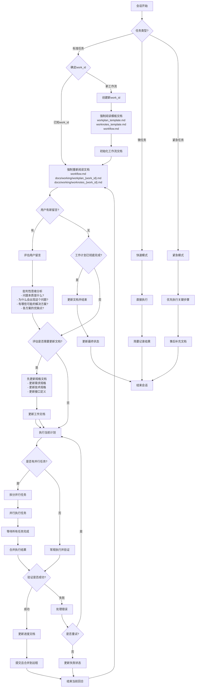

# AI 工作流

本文档概述了项目中 AI 会话的标准工作流程。

## 工作流程图



## 工作流程说明

1. **会话开始**：每个新的 AI 会话从这里开始

2. **任务类型判断**：
   - 标准任务：需要完整工作流程的常规任务
   - 微任务：简单、短期、无需详细记录的小任务
   - 紧急任务：需要立即执行的高优先级任务

3. **微任务处理**：
   - 直接执行：无需复杂的计划和文档
   - 简要记录：只记录关键结果，不创建详细文档
   - 快速结束：完成后直接结束会话

4. **紧急任务处理**：
   - 优先执行：立即执行关键步骤，不等待文档更新
   - 事后补充：任务完成后再补充必要的文档
   - 快速结束：完成后直接结束会话

5. **标准任务处理**：
   - **确定work_id**：
     - 如果是已知工作流，使用现有的work_id
     - 如果是新工作流，创建新的work_id并初始化相关文档
   - **阅读模板文档**：
     - 阅读 workplan_template.md（工作计划模板）
     - 阅读 worknotes_template.md（工作笔记模板）
     - 阅读 workflow.md（工作流程说明）
     - 确保新创建的文档遵循统一的格式和标准
   - **初始化工作流文档**：
    - 基于模板创建 docs/working/workplan_{work_id}.md
    - 基于模板创建 docs/working/worknotes_{work_id}.md
    - 添加新工作流，状态设为 `ACTIVE`
   - **阅读文档**：
     - 阅读 docs/workflow.md（工作流程说明）
     - 阅读 docs/working/workplan_{work_id}.md（任务非线性分解、动态规划、细节描述）
     - 阅读 docs/working/worknotes_{work_id}.md（上下文和经验）
   - **检查用户输入**：
     - 如有用户新输入，评估输入内容
     - 如无新输入，检查工作计划完成状态
     - 如用户请求暂停，保存当前状态并暂停工作流
   - **有用户输入时**：
     - **批判性思维分析**：
       - 深入理解问题本质：不仅看表面现象，要追问"为什么"
       - 识别根本原因：通过5个为什么法则找到问题根源
       - 探索多种解决方案：避免思维定势，考虑非常规方法
       - 权衡优缺点：客观评估每种方案的利弊
       - 记录思考过程：在worknotes中记录关键洞察
     - **规格优先原则**（强化工程化）：
       - 先更新需求规格文档
       - 再更新技术设计规格
       - 最后更新接口定义
       - 确保代码变更有据可依
     - 评估是否需要更新 docs/working/workplan_{work_id}.md 和 docs/working/worknotes_{work_id}.md
     - 如需要则按规格更新文档
     - 基于更新后的规格执行计划
   - **无用户输入时**：
     - 如工作计划已完成，更新文档并结束会话
     - 如工作计划未完成，直接执行当前计划
   - **执行计划**：
     - 根据 docs/working/workplan_{work_id}.md 执行下一步
     - **执行前批判性检查**：
       - 这是最优解决方案吗？
       - 有无遗漏的边界情况？
       - 是否符合最新的规格要求？
       - 执行风险评估如何？
     - **规格符合性验证**：
       - 确认实现与规格文档一致
       - 检查接口定义是否匹配
       - 验证性能指标是否达标
     - 检查是否有标记为 `[PARALLEL]` 的任务组（可选）
     - **重要**：脚本或代码创建后必须实际执行并验证结果
     - **禁止**：不允许仅创建脚本/代码就标记任务为完成

   - **更新进度**：
     - 更新 docs/working/workplan_{work_id}.md 的进度（仅在验证成功后）。注意：如当前环境支持任务管理也记得同步到环境的任务列表；
     - 更新 docs/working/worknotes_{work_id}.md 的上下文和经验,记录遇到的问题和解决方案;
     - **重要**：不要创建新的文档文件（如CHANGELOG.md），所有更新都应该记录在对应的工作文档中
   - **提交进度**：
     - 将更新的文档和代码变更提交到版本控制系统
     - 推送到远程仓库以保持同步
     - 确保工作成果得到持久化保存
     - 便于团队协作和进度跟踪
   - **循环完成**：
     - 结束当前回合，返回阅读文档开始下一循环

## 任务完成标准

为确保工作质量，任务只有在满足以下条件时才能标记为完成：

1. **代码/脚本创建**：代码或脚本已经创建并通过基本语法检查
2. **实际执行**：代码或脚本已被实际执行（非模拟执行）
3. **结果验证**：执行结果已被验证符合预期要求
4. **问题修复**：执行过程中发现的所有问题都已修复
5. **文档更新**：相关文档已更新，包括进度、经验和注意事项
6. **时间记录**：记录任务实际执行时间，用于后续估算优化

不满足以上全部条件的任务必须标记为"进行中"而非"已完成"。

## 执行效率优化

### 时间管理
- 每个任务开始前估算预期执行时间
- 记录实际执行时间，建立时间估算数据库
- 对超时任务进行分析和优化

### 资源管理
- 监控系统资源使用情况
- 对资源密集型任务进行调度优化
- 避免同时执行多个高资源消耗任务

此工作流确保任务持续推进，同时保持文档更新并适应用户输入。支持多工作流并行处理，通过唯一的work_id区分不同工作流的文档和状态。同时通过不同的任务模式，适应各种复杂度和紧急程度的工作场景。

## 工作流状态追踪

每个工作流的状态将在 `docs/working/workplan_{work_id}.md` 中进行集中追踪：

### 状态类型
- `ACTIVE` - 活跃执行中
- `PAUSED` - 已暂停
- `COMPLETED` - 已完成
- `FAILED` - 执行失败

### 状态记录格式
```
{work_id} | [状态] | [当前任务] | [进度百分比]
```

### 状态详情记录
每个状态还应包含：
- **执行日志**：关键操作的详细记录
- **错误信息**：失败时的具体错误描述
- **性能指标**：执行时间、资源使用等
- **依赖关系**：任务间的依赖状态

### 状态更新时机
- 工作流初始化时
- 每个主要阶段完成时
- 任务状态变更时
- 会话结束时


## 📁 项目规范 (必须遵守)

### 🚫 严格禁止的命名方式
以下命名方式**绝对禁止**，违反者必须立即重构：

#### ❌ 禁止的目录命名
- `tools_organized/` → 含义模糊
- `current/`, `new/`, `old/` → 版本控制应用Git分支
- `experimental/`, `legacy/` → 应删除或用Git管理
- `temp/`, `tmp/`, `backup/` → 不应在项目根目录
- `xxx_v1/`, `xxx_v2/` → 版本用Git标签管理
- `*_test/`, `*_demo/` → 应在 `tests/` 或 `examples/` 下

#### ❌ 禁止的文件命名
- `file_new.ext`, `file_old.ext` → 用Git历史管理
- `script_v2.sh`, `tool_final.c`, `xxxx_enhanced.c`, `xxxx_advance.c` → 避免胡乱的版本后缀!
- `temp_*.anything` → 临时文件不应提交
- `CHANGELOG.md` → 更新记录应在 worknotes_{work_id}.md 中
- `RELEASE_NOTES.md` → 发布说明应在工作文档中记录

### ✅ 强制的标准结构
```
/workspace/
├── src/                    # 源代码 (唯一源码位置)
│   ├── core/              # 核心编译器代码
│   ├── tools/             # 工具源码
│   └── cross/             # 交叉编译代码
├── bin/                   # 可执行文件 (唯一二进制位置)
├── scripts/               # 构建脚本 (唯一脚本位置)
├── tests/                 # 测试文件
├── docs/                  # 文档
│   ├── working/           # 工作文档（所有进度更新都在这里）
│   │   ├── workplan_*.md  # 工作计划文档
│   │   └── worknotes_*.md # 工作笔记文档
│   └── README.md          # 项目说明（功能导向）
└── examples/              # 示例代码
```

### 规范执行检查点

在工作流每个阶段必须检查：

#### 开发阶段检查
- [ ] 是否在 `src/` 中创建源码？
- [ ] 是否避免了临时目录？
- [ ] 命名是否符合功能导向原则？

#### 构建阶段检查  
- [ ] 可执行文件是否输出到 `bin/`？
- [ ] 构建脚本是否在 `scripts/`？
- [ ] 是否清理了临时文件？

#### 提交阶段检查
- [ ] 项目结构是否符合标准？
- [ ] 是否删除了所有禁止的目录？
- [ ] 文件命名是否规范？

### 违规处理流程

**发现违规命名时的必要步骤：**

1. **立即停止当前工作**
2. **重构到标准结构：**
   ```bash
   # 示例重构命令
   mkdir -p src/tools bin scripts
   mv tools_organized/current/* src/tools/
   mv *.sh scripts/
   rm -rf tools_organized/ backup/ temp/
   ```
3. **更新所有引用路径**
4. **验证功能正常**
5. **继续原工作**

### 文件组织原则

#### 源码组织 (`src/`)
- **按功能分模块**：`core/`, `tools/`, `cross/`
- **一个模块一个目录**：避免平铺所有文件
- **接口文件明确**：每个模块有清晰的API

#### 可执行文件 (`bin/`)
- **只放最终产品**：经过测试的可执行文件
- **命名简洁明确**：`c99bin`, `c99bin-cross`
- **避免中间产物**：不放调试版本

#### 脚本组织 (`scripts/`)
- **按功能分类**：`build/`, `test/`, `deploy/`
- **可执行权限**：所有脚本设置+x权限  
- **文档化参数**：每个脚本有使用说明

## 哲学思想，编程之道

- **文件管理**：只在必要时创建新文件,优先复用现有组件
- **规格驱动**：需求必须先形成规格文档,再据此规划任务
  - 规格文档包括：需求规格、技术规格、接口规格
  - 规格变更流程：分析影响→更新规格→审查确认→代码实现
  - 规格版本管理：每次重大变更记录版本号和变更原因
- **结构优先**：项目结构必须清晰规范，这是代码质量的基础
- **效率优化**：合理使用并行异步和空间换时间等策略提升效率
- **开发体验**：优先采用热更新机制,避免频繁重启
- **批判性思维**：
  - 质疑假设：不要接受表面答案，深挖问题本质
  - 多角度分析：从用户、系统、性能等多个维度思考
  - 证据驱动：基于数据和事实做决策，而非猜测
  - 持续反思：定期回顾决策，总结经验教训
  - 创新思维：敢于挑战常规，寻找更优解决方案

## 并行任务处理

对于需要并行处理的复杂任务：

### 任务并行化
- 在 `docs/working/workplan_{work_id}.md` 中使用 `[PARALLEL]` 标记可并行执行的任务组
- 示例：
  ```
  - T1 [50%] 核心功能开发 [PARALLEL]
    - T1.1 [100%] 组件A开发
    - T1.2 [75%] 组件B开发
  ```

### 并行任务管理
- 每个并行任务应有明确的输入和预期输出
- 并行任务之间应尽量减少依赖
- 在 `worknotes_{work_id}.md` 中记录每个并行分支的执行情况

## 工作流优化

### 持续改进
- **定期回顾**：分析工作流执行效率，识别改进点
- **批判性反思**：
  - 哪些决策是正确的？为什么？
  - 哪些可以做得更好？如何改进？
  - 有哪些意外发现？如何利用？
  - 思维盲点在哪里？如何避免？
- **模板更新**：基于实际使用情况优化模板文档
- **流程简化**：移除冗余步骤，优化关键路径
- **规格驱动改进**：
  - 收集规格执行反馈
  - 分析规格与实现差异
  - 优化规格制定流程
  - 建立规格质量标准
### 📋 并行开发实施指南

#### 第一步：模块化架构设计
```
1. 识别独立的功能模块
2. 定义清晰的模块接口
3. 确保模块间松耦合
4. 建立统一的数据结构
```

#### 第二步：并行开发规划
```
每轮并行开发应包含：
- 2-3个相关但独立的模块
- 明确的集成点
- 统一的测试策略
- 风险缓解计划
```

#### 第三步：同步执行策略
```
1. 同时创建多个模块文件
2. 采用统一的编码风格
3. 实时交叉验证接口
4. 持续集成测试
```

#### 第四步：质量保证体系
```
- 每个模块独立验证
- 模块间接口测试
- 整体集成验证
- 性能基准测试
```
